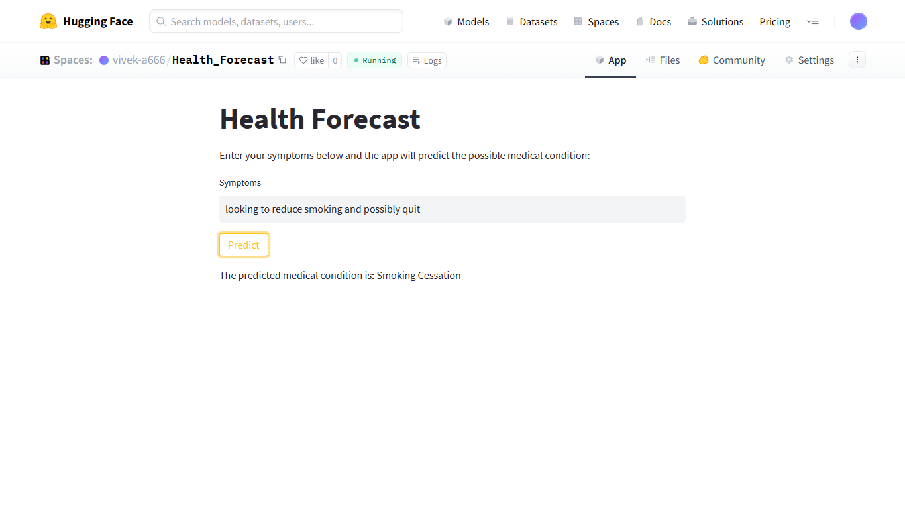
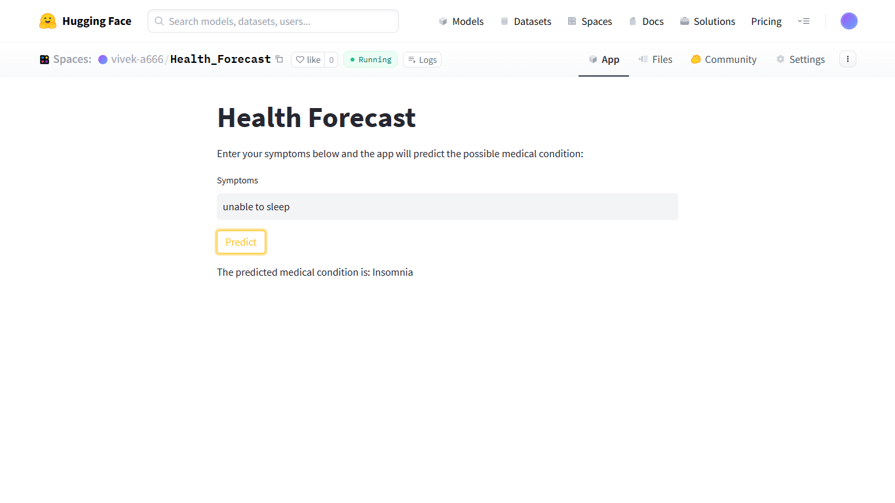
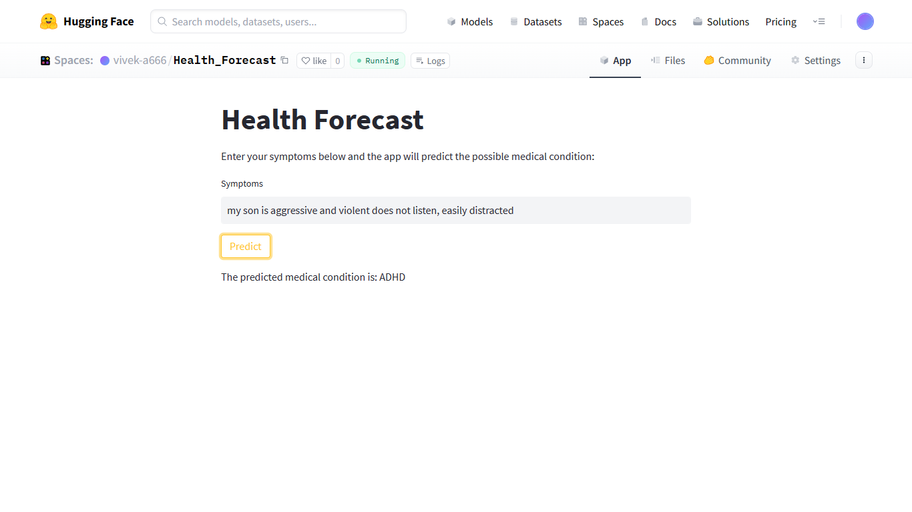

# Health-Forecast: Predicting Conditions from Symptoms

This is a project that uses machine learning algorithms to predict a medical condition based on symptoms input by the user. The goal of the project is to provide a quick and easy way for people to assess their risk for certain medical conditions and seek appropriate medical attention if necessary

## How it works?
The project uses the techniques of NLP and machine learning model trained on a dataset of "Drug Reviews". When the user inputs their symptoms, the model uses this information to predict the most likely medical condition.

## Resources
- [Dataset Link](https://archive.ics.uci.edu/ml/datasets/Drug+Review+Dataset+%28Drugs.com%29)
- [GloVe- Predefined Text embeddings](https://www.kaggle.com/datasets/takuok/glove840b300dtxt)

## Try it out!
- [Health-Forecast](https://huggingface.co/spaces/vivek-a666/Diagnosis_Prodigy)

## Screenshots

#### Note: The application may provide iaccurate or incorrect results since the model was trained on Drug reviews dataset which has lots data imbalance in it
